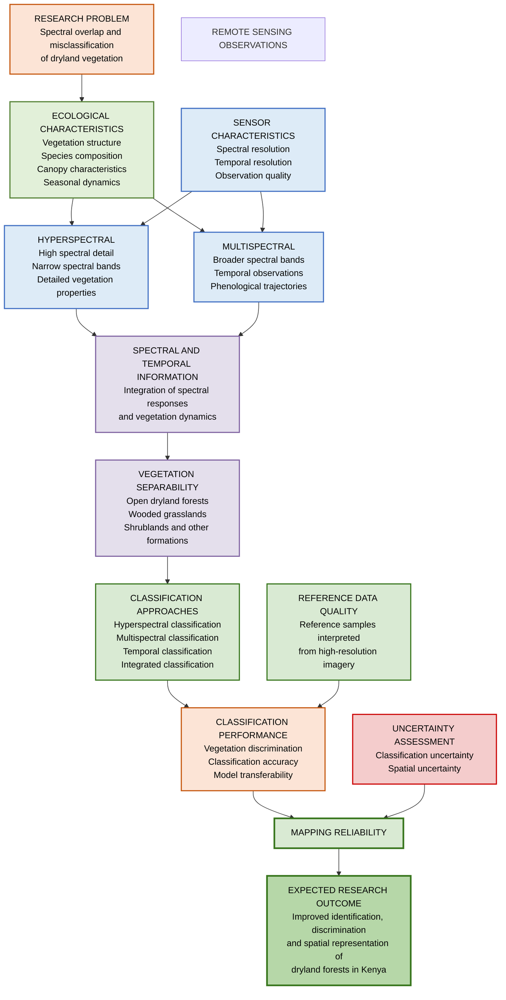

```mermaid

flowchart TD

    A["RESEARCH PROBLEM<br/>Spectral overlap and misclassification<br/>of dryland vegetation"]

    B["ECOLOGICAL CHARACTERISTICS<br/>Vegetation structure<br/>Species composition<br/>Canopy characteristics<br/>Seasonal dynamics"]

    C["REMOTE SENSING OBSERVATIONS"]

    C1["HYPERSPECTRAL<br/>High spectral detail<br/>Narrow spectral bands<br/>Detailed vegetation properties"]

    C2["MULTISPECTRAL<br/>Broader spectral bands<br/>Temporal observations<br/>Phenological trajectories"]

    C3["SENSOR CHARACTERISTICS<br/>Spectral resolution<br/>Temporal resolution<br/>Observation quality"]

    D["SPECTRAL AND TEMPORAL INFORMATION<br/>Integration of spectral responses<br/>and vegetation dynamics"]

    E["VEGETATION SEPARABILITY<br/>Open dryland forests<br/>Wooded grasslands<br/>Shrublands and other formations"]

    F["CLASSIFICATION APPROACHES<br/>Hyperspectral classification<br/>Multispectral classification<br/>Temporal classification<br/>Integrated classification"]

    G["REFERENCE DATA QUALITY<br/>Reference samples interpreted<br/>from high-resolution imagery"]

    H["CLASSIFICATION PERFORMANCE<br/>Vegetation discrimination<br/>Classification accuracy<br/>Model transferability"]

    I["UNCERTAINTY ASSESSMENT<br/>Classification uncertainty<br/>Spatial uncertainty"]

    J["MAPPING RELIABILITY"]

    K["EXPECTED RESEARCH OUTCOME<br/>Improved identification, discrimination<br/>and spatial representation of<br/>dryland forests in Kenya"]

    A --> B
    B --> C1
    B --> C2

    C1 --> D
    C2 --> D
    C3 --> C1
    C3 --> C2

    D --> E
    E --> F
    F --> H
    G --> H

    H --> J
    I --> J

    J --> K

    classDef problem fill:#FCE4D6,stroke:#C65911,stroke-width:2px,color:#000;
    classDef ecology fill:#E2F0D9,stroke:#548235,stroke-width:2px,color:#000;
    classDef remote fill:#DDEBF7,stroke:#4472C4,stroke-width:2px,color:#000;
    classDef analysis fill:#E4DFEC,stroke:#8064A2,stroke-width:2px,color:#000;
    classDef classification fill:#D9EAD3,stroke:#38761D,stroke-width:2px,color:#000;
    classDef evaluation fill:#FCE4D6,stroke:#C65911,stroke-width:2px,color:#000;
    classDef uncertainty fill:#F4CCCC,stroke:#CC0000,stroke-width:2px,color:#000;
    classDef reliability fill:#D9EAD3,stroke:#38761D,stroke-width:3px,color:#000;
    classDef outcome fill:#B6D7A8,stroke:#38761D,stroke-width:3px,color:#000;

    class A problem;
    class B ecology;
    class C1,C2,C3 remote;
    class D,E analysis;
    class F,G classification;
    class H evaluation;
    class I uncertainty;
    class J reliability;
    class K outcome;

   
```
