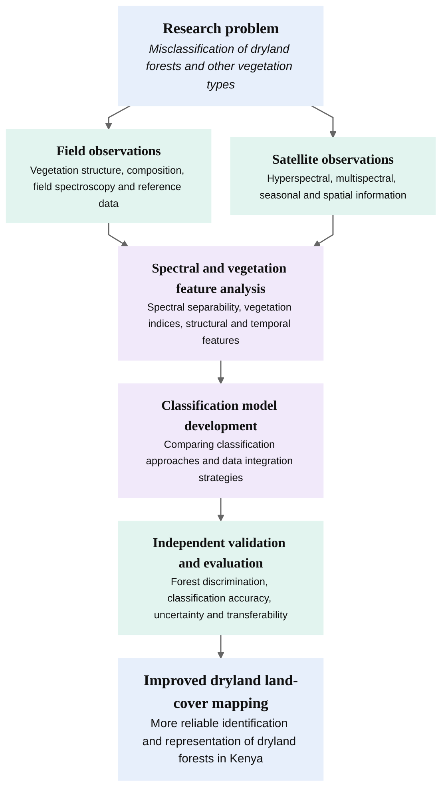

# Complete Research Guide Structure

```mermaid
%%{init: {
  "theme": "base",
  "themeVariables": {
    "fontFamily": "Arial, sans-serif",
    "fontSize": "14px",
    "lineColor": "#666666"
  },
  "flowchart": {
    "htmlLabels": true,
    "curve": "linear",
    "nodeSpacing": 25,
    "rankSpacing": 30
  }
}}%%

flowchart TB

    A["<span style='font-family:Georgia,serif;font-size:19px;font-weight:bold'>Research problem</span><br/><span style='font-family:Arial,sans-serif;font-size:15px;font-style:italic'>Misclassification of dryland forests and other vegetation types</span>"]

    B["<span style='font-family:Georgia,serif;font-size:17px;font-weight:bold'>Field observations</span><br/><span style='font-family:Arial,sans-serif;font-size:13px'>Vegetation structure, composition, field spectroscopy and reference data</span>"]

    C["<span style='font-family:Georgia,serif;font-size:17px;font-weight:bold'>Satellite observations</span><br/><span style='font-family:Arial,sans-serif;font-size:13px'>Hyperspectral, multispectral, seasonal and spatial information</span>"]

    D["<span style='font-family:Georgia,serif;font-size:17px;font-weight:bold'>Spectral and vegetation feature analysis</span><br/><span style='font-family:Arial,sans-serif;font-size:13px'>Spectral separability, vegetation indices, structural and temporal features</span>"]

    E["<span style='font-family:Georgia,serif;font-size:17px;font-weight:bold'>Classification model development</span><br/><span style='font-family:Arial,sans-serif;font-size:13px'>Comparing classification approaches and data integration strategies</span>"]

    F["<span style='font-family:Georgia,serif;font-size:17px;font-weight:bold'>Independent validation and evaluation</span><br/><span style='font-family:Arial,sans-serif;font-size:13px'>Forest discrimination, classification accuracy, uncertainty and transferability</span>"]

    G["<span style='font-family:Georgia,serif;font-size:19px;font-weight:bold'>Improved dryland land-cover mapping</span><br/><span style='font-family:Arial,sans-serif;font-size:15px'>More reliable identification and representation of dryland forests in Kenya</span>"]

    A --> B
    A --> C
    B --> D
    C --> D
    D --> E
    E --> F
    F --> G

    classDef blue fill:#E7EFFB,stroke:#E7EFFB,color:#111111,stroke-width:1px;
    classDef green fill:#E2F4EF,stroke:#E2F4EF,color:#111111,stroke-width:1px;
    classDef purple fill:#F1E9FA,stroke:#F1E9FA,color:#111111,stroke-width:1px;

    class A,G blue;
    class B,C,F green;
    class D,E purple;

    linkStyle default stroke:#666666,stroke-width:1.5px;

```
