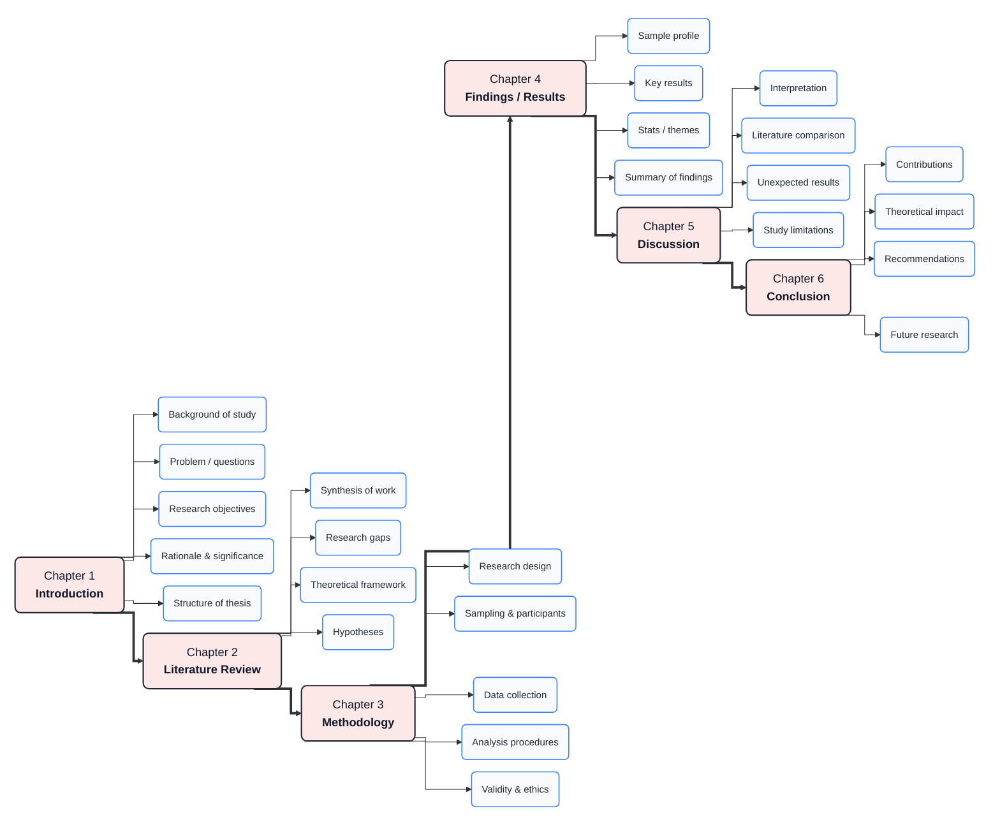

# Complete Research Guide Structure

```mermaid
%%{init: {'themeVariables': {'fontSize': '16px'}, 'flowchart': {'curve': 'stepAfter', 'nodeSpacing': 18, 'rankSpacing': 28}}}%%
flowchart LR
    %% Styling with large, crisp fonts
    classDef chapterBox fill:#fde8e8,stroke:#1f2937,stroke-width:2px,rx:8,ry:8,color:#111827,font-size:17px
    classDef subBox fill:#f8fafc,stroke:#3b82f6,stroke-width:1.5px,rx:6,ry:6,color:#1f2937,font-size:14px

    %% ==================== COLUMN 1: CHAPTERS 1 - 3 ====================
    subgraph Col1 [" "]
        direction TB
        
        %% Chapter 1
        Ch1["<span style='color:#dc2626;font-weight:bold'>Chapter 1</span><br/><b>Introduction</b>"]:::chapterBox
        C1_1("Background of study"):::subBox
        C1_2("Problem / questions"):::subBox
        C1_3("Research objectives"):::subBox
        C1_4("Rationale & significance"):::subBox
        C1_5("Structure of thesis"):::subBox
        Ch1 --> C1_1 & C1_2 & C1_3 & C1_4 & C1_5

        %% Chapter 2
        Ch2["<span style='color:#dc2626;font-weight:bold'>Chapter 2</span><br/><b>Literature Review</b>"]:::chapterBox
        C2_1("Synthesis of work"):::subBox
        C2_2("Research gaps"):::subBox
        C2_3("Theoretical framework"):::subBox
        C2_4("Hypotheses"):::subBox
        Ch2 --> C2_1 & C2_2 & C2_3 & C2_4

        %% Chapter 3
        Ch3["<span style='color:#dc2626;font-weight:bold'>Chapter 3</span><br/><b>Methodology</b>"]:::chapterBox
        C3_1("Research design"):::subBox
        C3_2("Sampling & participants"):::subBox
        C3_3("Data collection"):::subBox
        C3_4("Analysis procedures"):::subBox
        C3_5("Validity & ethics"):::subBox
        Ch3 --> C3_1 & C3_2 & C3_3 & C3_4 & C3_5

        %% Vertical flow down Column 1
        Ch1 ==> Ch2 ==> Ch3
    end

    %% ==================== COLUMN 2: CHAPTERS 4 - 6 ====================
    subgraph Col2 [" "]
        direction TB

        %% Chapter 4
        Ch4["<span style='color:#dc2626;font-weight:bold'>Chapter 4</span><br/><b>Findings / Results</b>"]:::chapterBox
        C4_1("Sample profile"):::subBox
        C4_2("Key results"):::subBox
        C4_3("Stats / themes"):::subBox
        C4_4("Summary of findings"):::subBox
        Ch4 --> C4_1 & C4_2 & C4_3 & C4_4

        %% Chapter 5
        Ch5["<span style='color:#dc2626;font-weight:bold'>Chapter 5</span><br/><b>Discussion</b>"]:::chapterBox
        C5_1("Interpretation"):::subBox
        C5_2("Literature comparison"):::subBox
        C5_3("Unexpected results"):::subBox
        C5_4("Study limitations"):::subBox
        Ch5 --> C5_1 & C5_2 & C5_3 & C5_4

        %% Chapter 6
        Ch6["<span style='color:#dc2626;font-weight:bold'>Chapter 6</span><br/><b>Conclusion</b>"]:::chapterBox
        C6_1("Contributions"):::subBox
        C6_2("Theoretical impact"):::subBox
        C6_3("Recommendations"):::subBox
        C6_4("Future research"):::subBox
        Ch6 --> C6_1 & C6_2 & C6_3 & C6_4

        %% Vertical flow down Column 2
        Ch4 ==> Ch5 ==> Ch6
    end

    %% ==================== LINK COLUMN 1 TO COLUMN 2 ====================
    Ch3 ==> Ch4

    %% Transparent containers
    style Col1 fill:transparent,stroke:none
    style Col2 fill:transparent,stroke:none
```
