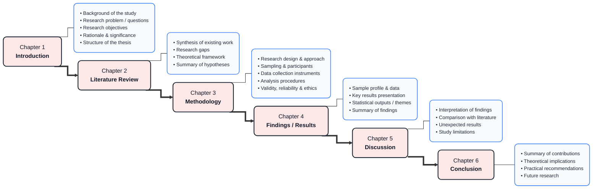

```mermaid
%%{init: {'flowchart': {'curve': 'stepAfter', 'nodeSpacing': 20, 'rankSpacing': 30}}}%%
flowchart LR
    classDef chapterBox fill:#fde8e8,stroke:#1f2937,stroke-width:2px,rx:8,ry:8,color:#111827,font-size:14px
    classDef subBox fill:#f8fafc,stroke:#3b82f6,stroke-width:1.5px,rx:8,ry:8,color:#1f2937,font-size:12px,text-align:left

    Ch1["<span style='color:#dc2626;font-weight:bold'>Chapter 1</span><br/><b>Introduction</b>"]:::chapterBox
    S1("• Background of the study<br/>• Research problem / questions<br/>• Research objectives<br/>• Rationale & significance<br/>• Structure of the thesis"):::subBox

    Ch2["<span style='color:#dc2626;font-weight:bold'>Chapter 2</span><br/><b>Literature Review</b>"]:::chapterBox
    S2("• Synthesis of existing work<br/>• Research gaps<br/>• Theoretical framework<br/>• Summary of hypotheses"):::subBox

    Ch3["<span style='color:#dc2626;font-weight:bold'>Chapter 3</span><br/><b>Methodology</b>"]:::chapterBox
    S3("• Research design & approach<br/>• Sampling & participants<br/>• Data collection instruments<br/>• Analysis procedures<br/>• Validity, reliability & ethics"):::subBox

    Ch4["<span style='color:#dc2626;font-weight:bold'>Chapter 4</span><br/><b>Findings / Results</b>"]:::chapterBox
    S4("• Sample profile & data<br/>• Key results presentation<br/>• Statistical outputs / themes<br/>• Summary of findings"):::subBox

    Ch5["<span style='color:#dc2626;font-weight:bold'>Chapter 5</span><br/><b>Discussion</b>"]:::chapterBox
    S5("• Interpretation of findings<br/>• Comparison with literature<br/>• Unexpected results<br/>• Study limitations"):::subBox

    Ch6["<span style='color:#dc2626;font-weight:bold'>Chapter 6</span><br/><b>Conclusion</b>"]:::chapterBox
    S6("• Summary of contributions<br/>• Theoretical implications<br/>• Practical recommendations<br/>• Future research"):::subBox

    Ch1 --- S1
    Ch2 --- S2
    Ch3 --- S3
    Ch4 --- S4
    Ch5 --- S5
    Ch6 --- S6

    Ch1 ==> Ch2 ==> Ch3 ==> Ch4 ==> Ch5 ==> Ch6
```
```
