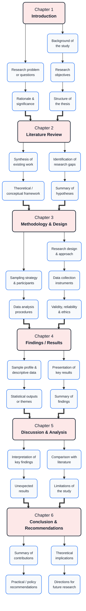

    # Complete Research Guide Structure

```mermaid
%%{init: {'flowchart': {'curve': 'stepAfter', 'nodeSpacing': 25, 'rankSpacing': 35}}}%%
flowchart TD
    %% Styling
    classDef chapterBox fill:#fde8e8,stroke:#1f2937,stroke-width:2px,rx:8,ry:8,color:#111827,font-size:15px
    classDef subBox fill:#f8fafc,stroke:#3b82f6,stroke-width:1.5px,rx:8,ry:8,color:#1f2937,font-size:12px

    %% ================= CHAPTER 1 =================
    Ch1["<span style='color:#dc2626;font-weight:bold'>Chapter 1</span><br/><b>Introduction</b>"]:::chapterBox
    C1_1("Background of<br/>the study"):::subBox
    C1_2("Research problem<br/>or questions"):::subBox
    C1_3("Research<br/>objectives"):::subBox
    C1_4("Rationale &<br/>significance"):::subBox
    C1_5("Structure of<br/>the thesis"):::subBox

    Ch1 --> C1_1 & C1_2
    C1_1 --> C1_3
    C1_2 --> C1_4
    C1_3 --> C1_5

    %% ================= CHAPTER 2 =================
    Ch2["<span style='color:#dc2626;font-weight:bold'>Chapter 2</span><br/><b>Literature Review</b>"]:::chapterBox
    C2_1("Synthesis of<br/>existing work"):::subBox
    C2_2("Identification of<br/>research gaps"):::subBox
    C2_3("Theoretical /<br/>conceptual framework"):::subBox
    C2_4("Summary of<br/>hypotheses"):::subBox

    Ch2 --> C2_1 & C2_2
    C2_1 --> C2_3
    C2_2 --> C2_4

    %% ================= CHAPTER 3 =================
    Ch3["<span style='color:#dc2626;font-weight:bold'>Chapter 3</span><br/><b>Methodology & Design</b>"]:::chapterBox
    C3_1("Research design<br/>& approach"):::subBox
    C3_2("Sampling strategy<br/>& participants"):::subBox
    C3_3("Data collection<br/>instruments"):::subBox
    C3_4("Data analysis<br/>procedures"):::subBox
    C3_5("Validity, reliability<br/>& ethics"):::subBox

    Ch3 --> C3_1 & C3_2
    C3_1 --> C3_3
    C3_2 --> C3_4
    C3_3 --> C3_5

    %% ================= CHAPTER 4 =================
    Ch4["<span style='color:#dc2626;font-weight:bold'>Chapter 4</span><br/><b>Findings / Results</b>"]:::chapterBox
    C4_1("Sample profile &<br/>descriptive data"):::subBox
    C4_2("Presentation of<br/>key results"):::subBox
    C4_3("Statistical outputs<br/>or themes"):::subBox
    C4_4("Summary of<br/>findings"):::subBox

    Ch4 --> C4_1 & C4_2
    C4_1 --> C4_3
    C4_2 --> C4_4

    %% ================= CHAPTER 5 =================
    Ch5["<span style='color:#dc2626;font-weight:bold'>Chapter 5</span><br/><b>Discussion & Analysis</b>"]:::chapterBox
    C5_1("Interpretation of<br/>key findings"):::subBox
    C5_2("Comparison with<br/>literature"):::subBox
    C5_3("Unexpected<br/>results"):::subBox
    C5_4("Limitations of<br/>the study"):::subBox

    Ch5 --> C5_1 & C5_2
    C5_1 --> C5_3
    C5_2 --> C5_4

    %% ================= CHAPTER 6 =================
    Ch6["<span style='color:#dc2626;font-weight:bold'>Chapter 6</span><br/><b>Conclusion & Recommendations</b>"]:::chapterBox
    C6_1("Summary of<br/>contributions"):::subBox
    C6_2("Theoretical<br/>implications"):::subBox
    C6_3("Practical / policy<br/>recommendations"):::subBox
    C6_4("Directions for<br/>future research"):::subBox

    Ch6 --> C6_1 & C6_2
    C6_1 --> C6_3
    C6_2 --> C6_4

    %% ============ MAIN SPINE CONNECTIONS ============
    C1_4 & C1_5 ==> Ch2
    C2_3 & C2_4 ==> Ch3
    C3_4 & C3_5 ==> Ch4
    C4_3 & C4_4 ==> Ch5
    C5_3 & C5_4 ==> Ch6
```
