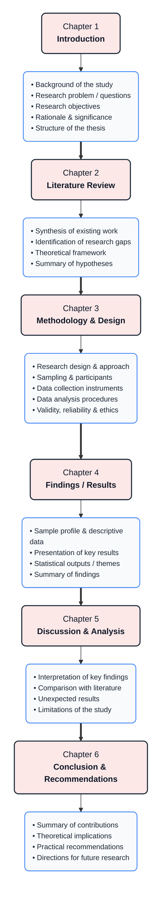

# Complete Research Guide Structure

```mermaid
%%{init: {'flowchart': {'curve': 'stepAfter', 'nodeSpacing': 20, 'rankSpacing': 35}}}%%
flowchart TD
    %% Styling with larger, readable fonts
    classDef chapterBox fill:#fde8e8,stroke:#1f2937,stroke-width:2px,rx:8,ry:8,color:#111827,font-size:16px
    classDef subBox fill:#f8fafc,stroke:#3b82f6,stroke-width:1.5px,rx:8,ry:8,color:#1f2937,font-size:14px,text-align:left

    %% ================= LEFT COLUMN (Chapters 1 - 3) =================
    subgraph LeftCol [" "]
        direction TB
        Ch1["<span style='color:#dc2626;font-weight:bold'>Chapter 1</span><br/><b>Introduction</b>"]:::chapterBox
        S1("• Background of the study<br/>• Research problem / questions<br/>• Research objectives<br/>• Rationale & significance<br/>• Structure of the thesis"):::subBox
        Ch1 --> S1

        Ch2["<span style='color:#dc2626;font-weight:bold'>Chapter 2</span><br/><b>Literature Review</b>"]:::chapterBox
        S2("• Synthesis of existing work<br/>• Identification of research gaps<br/>• Theoretical framework<br/>• Summary of hypotheses"):::subBox
        Ch2 --> S2

        Ch3["<span style='color:#dc2626;font-weight:bold'>Chapter 3</span><br/><b>Methodology & Design</b>"]:::chapterBox
        S3("• Research design & approach<br/>• Sampling & participants<br/>• Data collection instruments<br/>• Data analysis procedures<br/>• Validity, reliability & ethics"):::subBox
        Ch3 --> S3

        S1 ==> Ch2
        S2 ==> Ch3
    end

    %% ================= RIGHT COLUMN (Chapters 4 - 6) =================
    subgraph RightCol [" "]
        direction TB
        Ch4["<span style='color:#dc2626;font-weight:bold'>Chapter 4</span><br/><b>Findings / Results</b>"]:::chapterBox
        S4("• Sample profile & descriptive data<br/>• Presentation of key results<br/>• Statistical outputs / themes<br/>• Summary of findings"):::subBox
        Ch4 --> S4

        Ch5["<span style='color:#dc2626;font-weight:bold'>Chapter 5</span><br/><b>Discussion & Analysis</b>"]:::chapterBox
        S5("• Interpretation of key findings<br/>• Comparison with literature<br/>• Unexpected results<br/>• Limitations of the study"):::subBox
        Ch5 --> S5

        Ch6["<span style='color:#dc2626;font-weight:bold'>Chapter 6</span><br/><b>Conclusion & Recommendations</b>"]:::chapterBox
        S6("• Summary of contributions<br/>• Theoretical implications<br/>• Practical recommendations<br/>• Directions for future research"):::subBox
        Ch6 --> S6

        S4 ==> Ch5
        S5 ==> Ch6
    end

    %% ================= BRIDGE BETWEEN COLUMNS =================
    S3 ==> Ch4

    %% Hide subgraph borders so only the chapter cards appear
    style LeftCol fill:transparent,stroke:none
    style RightCol fill:transparent,stroke:none
```
