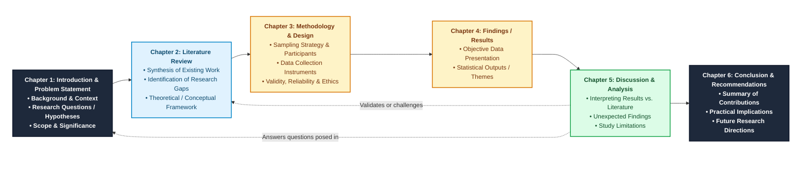

## Research Guide Structure

```mermaid
flowchart LR
    classDef startend fill:#1e293b,stroke:#0f172a,stroke-width:2px,color:#ffffff,font-weight:bold
    classDef setup fill:#e0f2fe,stroke:#0284c7,stroke-width:2px,color:#0c4a6e
    classDef execution fill:#fef3c7,stroke:#d97706,stroke-width:2px,color:#78350f
    classDef synthesis fill:#dcfce7,stroke:#16a34a,stroke-width:2px,color:#14532d

    %% Left Column: Chapters 1 - 4
    subgraph LeftCol [" "]
        direction TB
        Ch1["<b>Chapter 1: Introduction & Problem Statement</b><br/>• Background & Context<br/>• Research Questions / Hypotheses<br/>• Scope & Significance"]:::startend
        Ch2["<b>Chapter 2: Literature Review</b><br/>• Synthesis of Existing Work<br/>• Identification of Research Gaps<br/>• Theoretical / Conceptual Framework"]:::setup
        Ch3["<b>Chapter 3: Methodology & Design</b><br/>• Sampling Strategy & Participants<br/>• Data Collection Instruments<br/>• Validity, Reliability & Ethics"]:::execution
        Ch4["<b>Chapter 4: Findings / Results</b><br/>• Objective Data Presentation<br/>• Statistical Outputs / Themes"]:::execution

        Ch1 --> Ch2 --> Ch3 --> Ch4
    end

    %% Right Column: Chapters 5 - 6
    subgraph RightCol [" "]
        direction TB
        Ch5["<b>Chapter 5: Discussion & Analysis</b><br/>• Interpreting Results vs. Literature<br/>• Unexpected Findings<br/>• Study Limitations"]:::synthesis
        Ch6["<b>Chapter 6: Conclusion & Recommendations</b><br/>• Summary of Contributions<br/>• Practical Implications<br/>• Future Research Directions"]:::startend

        Ch5 --> Ch6
    end

    %% Main Flow from Chapter 4 (bottom-left) to Chapter 5 (top-right)
    Ch4 --> Ch5

    %% Horizontal Feedback Loops from Right Column back to Left Column
    Ch5 -. "Answers questions posed in" .-> Ch1
    Ch5 -. "Validates or challenges" .-> Ch2

    %% Hide container borders
    style LeftCol fill:transparent,stroke:none
    style RightCol fill:transparent,stroke:none
```

