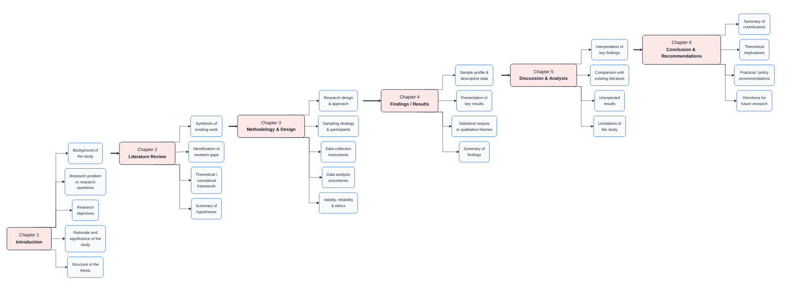

# Research Guide Structure

```mermaid
%%{init: {'flowchart': {'curve': 'stepAfter', 'nodeSpacing': 16, 'rankSpacing': 30}}}%%
flowchart LR
    classDef chapterBox fill:#fde8e8,stroke:#1f2937,stroke-width:1.5px,rx:8,ry:8,color:#111827,font-size:15px
    classDef subBox fill:#f8fafc,stroke:#3b82f6,stroke-width:1.5px,rx:8,ry:8,color:#1f2937,font-size:13px

    %% ==================== COLUMN 1 (CHAPTERS 1 - 3) ====================
    subgraph Col1 [" "]
        direction TB

        %% Chapter 1
        Ch1["<span style='color:#dc2626;font-weight:bold'>Chapter 1</span><br/><b>Introduction</b>"]:::chapterBox
        subgraph G1 [" "]
            direction LR
            C1_1("Background of<br/>the study"):::subBox
            C1_2("Research problem<br/>or research<br/>questions"):::subBox
            C1_3("Research<br/>objectives"):::subBox
            C1_4("Rationale and<br/>significance of the<br/>study"):::subBox
            C1_5("Structure of the<br/>thesis"):::subBox
        end
        Ch1 --> C1_1 & C1_2 & C1_3 & C1_4 & C1_5

        %% Chapter 2
        Ch2["<span style='color:#dc2626;font-weight:bold'>Chapter 2</span><br/><b>Literature Review</b>"]:::chapterBox
        subgraph G2 [" "]
            direction LR
            C2_1("Synthesis of<br/>existing work"):::subBox
            C2_2("Identification of<br/>research gaps"):::subBox
            C2_3("Theoretical /<br/>conceptual<br/>framework"):::subBox
            C2_4("Summary of<br/>hypotheses"):::subBox
        end
        Ch2 --> C2_1 & C2_2 & C2_3 & C2_4

        %% Chapter 3
        Ch3["<span style='color:#dc2626;font-weight:bold'>Chapter 3</span><br/><b>Methodology & Design</b>"]:::chapterBox
        subgraph G3 [" "]
            direction LR
            C3_1("Research design<br/>& approach"):::subBox
            C3_2("Sampling strategy<br/>& participants"):::subBox
            C3_3("Data collection<br/>instruments"):::subBox
            C3_4("Data analysis<br/>procedures"):::subBox
            C3_5("Validity, reliability<br/>& ethics"):::subBox
        end
        Ch3 --> C3_1 & C3_2 & C3_3 & C3_4 & C3_5

        %% Continuous flow down Column 1
        G1 ==> Ch2
        G2 ==> Ch3
    end

    %% ==================== COLUMN 2 (CHAPTERS 4 - 6) ====================
    subgraph Col2 [" "]
        direction TB

        %% Chapter 4
        Ch4["<span style='color:#dc2626;font-weight:bold'>Chapter 4</span><br/><b>Findings / Results</b>"]:::chapterBox
        subgraph G4 [" "]
            direction LR
            C4_1("Sample profile &<br/>descriptive data"):::subBox
            C4_2("Presentation of<br/>key results"):::subBox
            C4_3("Statistical outputs<br/>or qualitative themes"):::subBox
            C4_4("Summary of<br/>findings"):::subBox
        end
        Ch4 --> C4_1 & C4_2 & C4_3 & C4_4

        %% Chapter 5
        Ch5["<span style='color:#dc2626;font-weight:bold'>Chapter 5</span><br/><b>Discussion & Analysis</b>"]:::chapterBox
        subgraph G5 [" "]
            direction LR
            C5_1("Interpretation of<br/>key findings"):::subBox
            C5_2("Comparison with<br/>existing literature"):::subBox
            C5_3("Unexpected<br/>results"):::subBox
            C5_4("Limitations of<br/>the study"):::subBox
        end
        Ch5 --> C5_1 & C5_2 & C5_3 & C5_4

        %% Chapter 6
        Ch6["<span style='color:#dc2626;font-weight:bold'>Chapter 6</span><br/><b>Conclusion & Recommendations</b>"]:::chapterBox
        subgraph G6 [" "]
            direction LR
            C6_1("Summary of<br/>contributions"):::subBox
            C6_2("Theoretical<br/>implications"):::subBox
            C6_3("Practical / policy<br/>recommendations"):::subBox
            C6_4("Directions for<br/>future research"):::subBox
        end
        Ch6 --> C6_1 & C6_2 & C6_3 & C6_4

        %% Continuous flow down Column 2
        G4 ==> Ch5
        G5 ==> Ch6
    end

    %% ==================== BRIDGE COLUMN 1 TO COLUMN 2 ====================
    G3 ==> Ch4

    %% Hide all container borders so only boxes and arrows show
    style Col1 fill:transparent,stroke:none
    style Col2 fill:transparent,stroke:none
    style G1 fill:transparent,stroke:none
    style G2 fill:transparent,stroke:none
    style G3 fill:transparent,stroke:none
    style G4 fill:transparent,stroke:none
    style G5 fill:transparent,stroke:none
    style G6 fill:transparent,stroke:none
```
